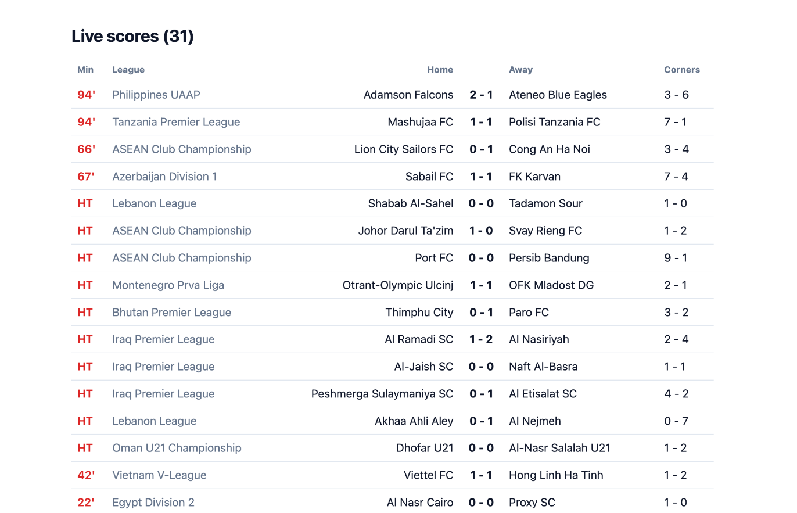

# Football live score app (Node.js)

A live football scoreboard in one file: every match in play, with the minute, the score and the corner count. No framework, one dependency, **one API call** per refresh.

Built on the [5DollarFootballAPI](https://5dollarfootballapi.com), a cheap football data API. Runs on the **free plan** (top-5 European leagues, no credit card).



See the walkthrough, with sample output: **[5dollarfootballapi.com/examples/live-score-app](https://5dollarfootballapi.com/examples/live-score-app)**

## Run it

1. Get a free API key at [5dollarfootballapi.com](https://5dollarfootballapi.com).
2. Install and run (Node 18+):

```bash
npm install
FIVEDOLLARFOOTBALL_API_KEY=fb_live_your_key npm start
```

Open [http://localhost:3000](http://localhost:3000). The page reloads itself every minute. Set `PORT` to use another port.

The screenshot above was taken with an Ultra key, which returns every league. A free key returns live matches from the top-5 leagues.

## How it works

One request fills the whole screen:

| Call | What it returns |
|---|---|
| `GET /v1/fixtures?status=live&per_page=500` | Every match in play right now, on one page. |

Each match looks like this:

```json
{
  "id": 423525018,
  "league": { "id": 2193341818, "name": "Philippines UAAP" },
  "teams": { "home": { "id": 351871266, "name": "Adamson Falcons" }, "away": { "id": 3440454686, "name": "Ateneo Blue Eagles" } },
  "status": "in_play",
  "status_code": "76",
  "goals": { "home": 1, "away": 1, "half_home": 1, "half_away": 1 },
  "corners": { "home": 3, "away": 4, "half_home": 3, "half_away": 3 },
  "cards": { "home": { "yellow": 1, "red": 0 }, "away": { "yellow": 0, "red": 0 } }
}
```

`status_code` is the running minute, or `half` during the break.

Two things worth copying into your own app:

- **The key stays on the server.** A key in browser JavaScript can be read by anyone who opens the page. Here the browser only receives rendered HTML.
- **One cache for everyone.** The server asks the API at most once a minute, so a thousand visitors cost the same 60 requests an hour as one — which is exactly the free plan's allowance.

Reference: [`/v1/fixtures`](https://5dollarfootballapi.com/docs/fixtures) · [Node.js client](https://github.com/5dollarfootball-api/football-api-js-sdk)

## Take it further

- Add `include: ['events']` to get each match's goal, corner and card timeline in the same call.
- Add `include: ['stats']` for attacks, shots and possession per match.
- Pass `league: id` to show one competition only.
- Call `client.fixtures()` with no status for the whole day: fixtures, live matches and results.
- Pass `lang: 'es'` (or any of 21 languages) for localized team and league names.

## Plans

The free plan covers the top-5 European leagues at 60 requests an hour. Pro ($5/mo) covers 130+ competitions at 10 requests a minute; Ultra ($25/mo) covers every league. [Pricing](https://5dollarfootballapi.com/pricing)

## More examples

- [football-goal-alert-bot](https://github.com/5dollarfootball-api/football-goal-alert-bot) — goal alerts in Telegram or Discord
- [football-odds-backtest](https://github.com/5dollarfootball-api/football-odds-backtest) — simple bets settled at opening vs closing odds
- [football-odds-movement-chart](https://github.com/5dollarfootball-api/football-odds-movement-chart) — chart every price move of a match
- [football-corner-stats-table](https://github.com/5dollarfootball-api/football-corner-stats-table) — a league corner table from one call
- [All examples](https://5dollarfootballapi.com/examples)

## License

[MIT](LICENSE). Football data by [5DollarFootballAPI](https://5dollarfootballapi.com).
